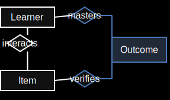

# Lab 3 — Plan (Beginner-First, OBER-Aligned)

## Context

Lab 3 builds on Lab 2, where students already:

- Ran and debugged a FastAPI service
- Used GitHub issues/PRs/reviews
- Used Docker Compose
- Deployed to a Linux VM

From this lab onward, we keep one product across labs: an outcome-based educational recommender inspired by OBER.

We start from a seeded backend:

- Database already contains `items`, `outcomes`, `learners`, `interaction_logs` (anonymized)
- Endpoints for `items`, `outcomes`, `learners` are already implemented
- `/docs` is already available via FastAPI Swagger UI

---

## Core model

---

## Design principles for this cohort

1. Start with observation, not coding.
2. Teach REST as a minimal practical contract, not theory-heavy architecture.
3. Reuse existing endpoint patterns for first feature work.
4. Keep one business-logic task (mastery) as the main challenge.
5. Treat security as both app-level (auth/permissions) and server-level (hardening).

---

## REST scope (minimum only)

Students must understand and apply:

- Noun-based resource paths (`/interactions`, `/verifications`)
- Core methods (`GET`, `POST`, `PUT`)
- Core statuses (`200`, `201`, `400/422`, `404`, `401`, `403`)
- Query filters + pagination basics
- Request/response schemas via Pydantic

We intentionally skip advanced REST topics (HATEOAS, versioning strategy, caching semantics).

---

## Story

> "The prototype works and is deployed (Lab 2).
> Now we need to make it production-ready:
> strengthen the API contract, expose interaction logs,
> add item-outcome mappings, implement and test mastery,
> secure the service, and deploy it on a hardened VM."

---

## Required tasks

### Task 1: Explore existing API via Swagger (no coding yet)

Students:

- Run the project and open `/docs`
- Try existing `learners` and `outcomes` endpoints
- Record method, path, status, and response shape examples

Goal: understand API contracts before implementation work.

---

### Task 2: Implement interaction log read endpoint (by example)

Students implement:

- `GET /interactions` (filters + pagination)

Data flow note:

- Interaction records are imported from autochecker logs.
- Students do not implement `POST /interactions` in Lab 3.

Goal: first independent endpoint implementation by copying established project patterns.

Potential tests (provided by instructors):

- `GET /interactions` returns `200` and a list response.
- `GET /interactions?learner_id=...` returns `200` and filtered records.
- `GET /interactions?limit=20&offset=0` respects pagination parameters.

Potential tests (students implement):

- Combined filters (`learner_id` + `item_id`) behave correctly.
- Invalid pagination/query values return validation errors (`422`).
- Empty-result filters return `200` with an empty list.

---

### Task 3: Add verifications table + endpoints

Students:

- Create verification mapping table between `items` and `outcomes`
- Implement endpoints to read, add, and edit verifications

Schema simplification (for this cohort):

- Keep verifications as a simple mapping only (`item_id` <-> `outcome_id`)
- Do not introduce relation types in Lab 3

Suggested endpoints:

- `GET /verifications`
- `POST /verifications`
- `PUT /verifications/{id}`

Goal: build the core OBER connection layer used by later labs.

Potential tests (provided by instructors):

- `POST /verifications` with valid IDs returns `201`.
- `GET /verifications` returns `200` and list response.
- `PUT /verifications/{id}` updates mapping and returns success.

Potential tests (students implement):

- Duplicate `(item_id, outcome_id)` mapping is rejected.
- Invalid `item_id` or `outcome_id` is rejected.
- Updated verification appears in subsequent read responses.

---

### Task 4: Implement and test mastery endpoint

Students:

- Implement mastery calculation endpoint(s)
- Add robust tests for normal and edge cases

Suggested endpoints:

- `GET /mastery/{learner_id}`
- `GET /mastery/{learner_id}/total`

Goal: implement meaningful product logic and prove correctness with tests.

Potential tests (provided by instructors):

- `GET /mastery/{learner_id}` returns `200` with required fields.
- `GET /mastery/{learner_id}` scores are within `[0.0, 1.0]`.
- Nonexistent learner returns `404`.

Potential tests (students implement):

- Happy path with deterministic fixture data.
- No-interaction / no-verification cases produce expected defaults.
- Threshold/aggregation behavior matches the intended formula.

---

### Task 5: Security task (auth/permissions + VM hardening)

This is one combined security task.

App security:

- Add API-key authentication for write operations
- Add simple permission checks (read vs write/admin behavior)
- Return proper auth statuses (`401`, `403`)

Server security:

- Create non-root SSH user for operations
- Configure firewall (`ufw`)
- Configure fail2ban
- Disable root password login
- Create dedicated `checkbot` SSH user (restricted, no sudo)

Goal: connect API security and infrastructure security in one coherent task.

Scope note:

- If this task is too heavy, server hardening can be moved to Lab 4 while keeping API-key auth in Lab 3.

Potential tests (provided by instructors):

- Write endpoints without API key return `401`.
- Write endpoints with invalid/insufficient key return `403`.
- VM hardening checks via `checkbot` SSH:
  - `checkbot` has no sudo access
  - `fail2ban` is active
  - `PermitRootLogin no` and `PasswordAuthentication no` are set

Potential tests (students implement):

- API auth tests for write endpoints (missing key, invalid key, valid key).
- Permission tests separating read vs write behavior.

---

### Task 6: Deploy to hardened VM

Students deploy the updated service to their VM and verify:

- Public read endpoints work
- Mastery endpoint works
- Security configuration remains active after deployment

Potential deployment checks (instructor/autochecker):

- `GET /status` returns `200`.
- `GET /interactions` returns `200`.
- `GET /verifications` returns `200`.
- `GET /mastery/{learner_id}` returns `200`.

---

## Optional tasks

- Add `DELETE /verifications/{id}`
- Add OpenAPI examples for all new payloads
- Add DB migration tooling (Alembic)
- Add endpoint-level audit logging for write actions

---

## Open questions

1. Hardening depth:
Should we require `PasswordAuthentication no` for everyone, or allow key-only root-disabled minimum?

2. Checkbot restrictions:
Command-restricted SSH key now, or in a later lab?

3. CI placement:
CI checks are a good candidate for Lab 4 if Lab 3 scope gets tight.

4. Scope pressure:
If needed, split Task 5:
- Lab 3: API-key auth + minimal permissions
- Lab 4: full hardening checklist + CI
